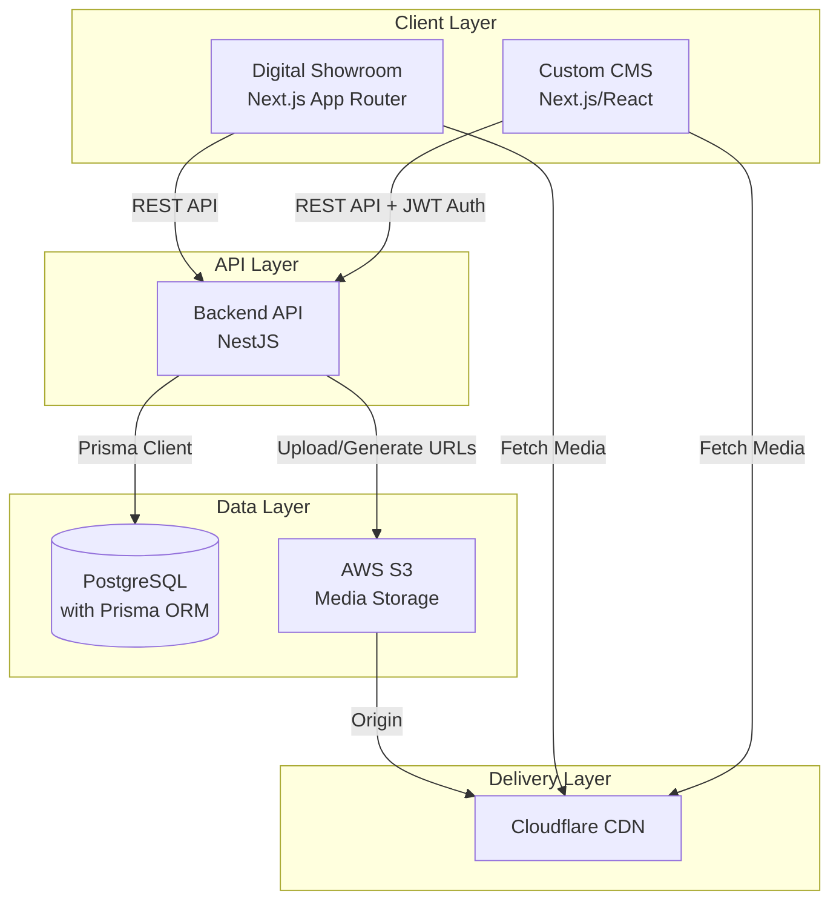
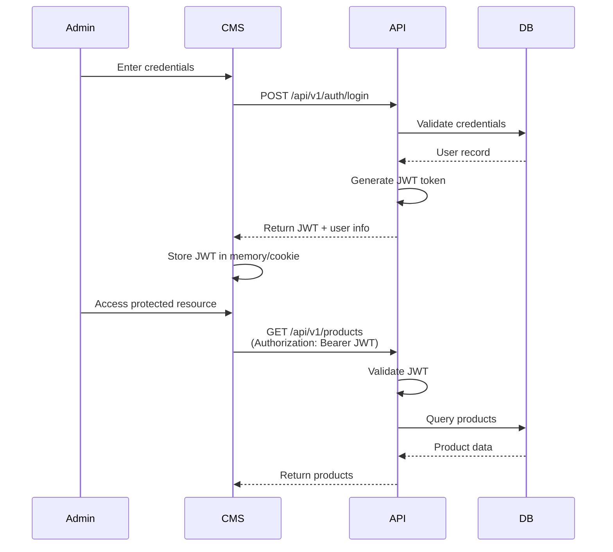
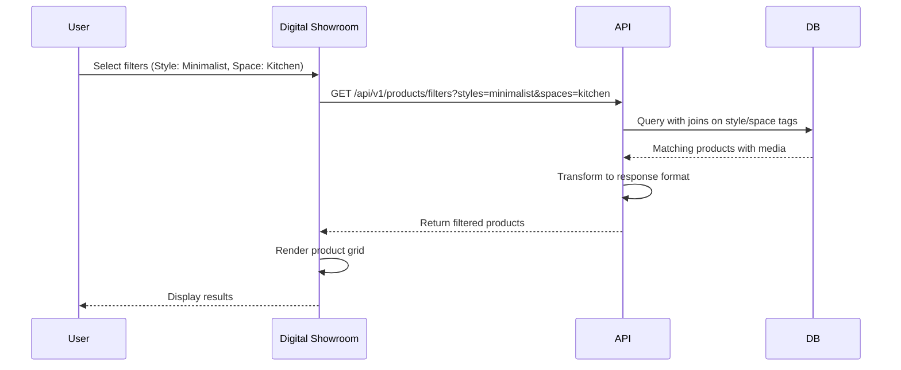

# Design Document: Digital Showroom and Custom CMS

## Overview

This document specifies the technical design for a Digital Showroom and Custom CMS system for luxury building materials. The system consists of three primary components:

1. **Digital Showroom (Frontend)**: A Next.js application using the App Router, providing a premium visual experience for browsing products, applying dual-tab filters, and submitting lead forms.

2. **Backend API**: A NestJS REST API handling business logic, data validation, authentication, and integration with PostgreSQL and AWS S3.

3. **Custom CMS (Admin Dashboard)**: A Next.js or React application providing authenticated admin users with interfaces to manage products, media, categories, tags, and leads.

The architecture follows a clean separation of concerns with the frontend applications consuming the Backend API through RESTful endpoints. Authentication uses JWT tokens for stateless authorization. Media assets are stored in AWS S3 and delivered through Cloudflare CDN for optimal performance.

## Architecture

### System Components



### Technology Stack

- **Frontend**: Next.js 14+ (App Router), React 18+, TypeScript, Tailwind CSS, Framer Motion
- **Backend**: NestJS, TypeScript, Prisma ORM
- **Database**: PostgreSQL 14+
- **Storage**: AWS S3
- **CDN**: Cloudflare
- **Authentication**: JWT (JSON Web Tokens)
- **API Protocol**: REST with JSON payloads

### Authentication Flow



### Data Flow: Product Filtering



## Components and Interfaces

### Core Entities

#### User Entity

- **Purpose**: Represents admin users with CMS access
- **Key Fields**: id (UUID), email (unique), password_hash, role, created_at, updated_at
- **Relationships**: None (simple authentication model)

#### Category Entity

- **Purpose**: Hierarchical organization of products (Tiles > Floor Tiles > Porcelain)
- **Key Fields**: id (UUID), name, slug (unique), parent_id (self-reference), created_at, updated_at
- **Relationships**: Self-referencing for hierarchy, one-to-many with Products

#### Product Entity

- **Purpose**: Core building material items with flexible attributes
- **Key Fields**: id (UUID), name, sku (unique), description, category_id, technical_specs (JSONB), is_published, created_at, updated_at
- **Relationships**: Many-to-one with Category, many-to-many with Style/Space tags, one-to-many with Media

#### Style and Space Tags

- **Purpose**: Enable inspiration-based filtering (Style: Minimalist, Space: Kitchen)
- **Key Fields**: id (UUID), name (unique), type (style/space), created_at, updated_at
- **Relationships**: Many-to-many with Products through junction tables

#### Media Entity

- **Purpose**: Manage multiple asset types per product with ordering and classification
- **Key Fields**: id (UUID), product_id, file_url, file_type, media_type, sort_order, is_cover, file_size, created_at, updated_at
- **Relationships**: Many-to-one with Product

#### Lead Entity

- **Purpose**: Capture and track customer inquiries from forms
- **Key Fields**: id (UUID), name, email, phone, inquiry_type, project_details, status, preferred_date, created_at, updated_at
- **Relationships**: None (standalone entity for lead management)

### API Interface Design

#### Authentication Endpoints

```typescript
// POST /api/v1/auth/login
interface LoginRequest {
  email: string;
  password: string;
}

interface LoginResponse {
  access_token: string;
  user: {
    id: string;
    email: string;
    role: string;
  };
}

// POST /api/v1/auth/refresh
interface RefreshResponse {
  access_token: string;
}
```

#### Product Management Endpoints

```typescript
// GET /api/v1/products/filters
interface ProductFiltersRequest {
  categories?: string[];
  styles?: string[];
  spaces?: string[];
  technical_specs?: Record<string, any>;
  search?: string;
  page?: number;
  limit?: number;
}

interface ProductFiltersResponse {
  products: Product[];
  pagination: {
    page: number;
    limit: number;
    total: number;
    total_pages: number;
  };
  filters: {
    available_styles: Style[];
    available_spaces: Space[];
    available_categories: Category[];
  };
}

// POST /api/v1/products
interface CreateProductRequest {
  name: string;
  sku: string;
  description?: string;
  category_id: string;
  technical_specs: Record<string, any>;
  style_ids?: string[];
  space_ids?: string[];
}
```

#### Media Management Endpoints

```typescript
// POST /api/v1/products/{id}/media
interface UploadMediaRequest {
  file: File;
  media_type: "lifestyle" | "cutout" | "video" | "3d_file" | "pdf";
  is_cover?: boolean;
}

interface MediaResponse {
  id: string;
  file_url: string;
  media_type: string;
  file_size: number;
  sort_order: number;
  is_cover: boolean;
}

// GET /api/v1/media/{id}/download
interface DownloadResponse {
  download_url: string;
  expires_at: string;
}
```

#### Lead Management Endpoints

```typescript
// POST /api/v1/leads
interface CreateLeadRequest {
  name: string;
  email?: string;
  phone?: string;
  inquiry_type: "appointment" | "quote";
  project_details?: string;
  preferred_date?: string;
  product_ids?: string[];
}

// GET /api/v1/leads (Admin only)
interface LeadsListRequest {
  status?: "new" | "contacted" | "converted";
  page?: number;
  limit?: number;
}
```

## Data Models

### Prisma Schema

```prisma
generator client {
  provider = "prisma-client-js"
}

datasource db {
  provider = "postgresql"
  url      = env("DATABASE_URL")
}

model User {
  id           String   @id @default(uuid()) @db.Uuid
  email        String   @unique
  password_hash String
  role         String   @default("admin")
  created_at   DateTime @default(now())
  updated_at   DateTime @updatedAt

  @@map("users")
}

model Category {
  id         String     @id @default(uuid()) @db.Uuid
  name       String
  slug       String     @unique
  parent_id  String?    @db.Uuid
  created_at DateTime   @default(now())
  updated_at DateTime   @updatedAt

  parent   Category?  @relation("CategoryHierarchy", fields: [parent_id], references: [id])
  children Category[] @relation("CategoryHierarchy")
  products Product[]

  @@index([parent_id])
  @@map("categories")
}

model Product {
  id              String   @id @default(uuid()) @db.Uuid
  name            String
  sku             String   @unique
  description     String?
  category_id     String   @db.Uuid
  technical_specs Json     @db.JsonB
  is_published    Boolean  @default(false)
  created_at      DateTime @default(now())
  updated_at      DateTime @updatedAt

  category      Category            @relation(fields: [category_id], references: [id])
  media         Media[]
  style_tags    ProductStyleTag[]
  space_tags    ProductSpaceTag[]
  lead_products LeadProduct[]

  @@index([category_id])
  @@index([is_published])
  @@index([created_at])
  @@index(technical_specs, type: Gin)
  @@map("products")
}

model Style {
  id         String   @id @default(uuid()) @db.Uuid
  name       String   @unique
  created_at DateTime @default(now())
  updated_at DateTime @updatedAt

  products ProductStyleTag[]

  @@map("styles")
}

model Space {
  id         String   @id @default(uuid()) @db.Uuid
  name       String   @unique
  created_at DateTime @default(now())
  updated_at DateTime @updatedAt

  products ProductSpaceTag[]

  @@map("spaces")
}

model ProductStyleTag {
  product_id String @db.Uuid
  style_id   String @db.Uuid

  product Product @relation(fields: [product_id], references: [id], onDelete: Cascade)
  style   Style   @relation(fields: [style_id], references: [id], onDelete: Cascade)

  @@id([product_id, style_id])
  @@map("product_style_tags")
}

model ProductSpaceTag {
  product_id String @db.Uuid
  space_id   String @db.Uuid

  product Product @relation(fields: [product_id], references: [id], onDelete: Cascade)
  space   Space   @relation(fields: [space_id], references: [id], onDelete: Cascade)

  @@id([product_id, space_id])
  @@map("product_space_tags")
}

model Media {
  id         String   @id @default(uuid()) @db.Uuid
  product_id String   @db.Uuid
  file_url   String
  file_type  String
  media_type String
  sort_order Int      @default(0)
  is_cover   Boolean  @default(false)
  file_size  Int?
  created_at DateTime @default(now())
  updated_at DateTime @updatedAt

  product Product @relation(fields: [product_id], references: [id], onDelete: Cascade)

  @@index([product_id])
  @@index([media_type])
  @@index([sort_order])
  @@map("media")
}

model Lead {
  id              String   @id @default(uuid()) @db.Uuid
  name            String
  email           String?
  phone           String?
  inquiry_type    String
  project_details String?
  status          String   @default("new")
  preferred_date  DateTime?
  created_at      DateTime @default(now())
  updated_at      DateTime @updatedAt

  products LeadProduct[]

  @@index([status])
  @@index([created_at])
  @@map("leads")
}

model LeadProduct {
  lead_id    String @db.Uuid
  product_id String @db.Uuid

  lead    Lead    @relation(fields: [lead_id], references: [id], onDelete: Cascade)
  product Product @relation(fields: [product_id], references: [id], onDelete: Cascade)

  @@id([lead_id, product_id])
  @@map("lead_products")
}
```

### Technical Specifications Schema Examples

```typescript
// Tile Product Technical Specs
interface TileTechnicalSpecs {
  thickness: number; // in mm
  slip_resistance: string; // R9, R10, R11, etc.
  format: string; // "Slab", "Mosaic", "Hexagon"
  material: string; // "Porcelain", "Ceramic", "Natural Stone"
  finish: string; // "Matte", "Glossy", "Textured"
  water_absorption: number; // percentage
  frost_resistance: boolean;
  dimensions: {
    length: number;
    width: number;
    thickness: number;
  };
  color_palette: string[]; // ["White", "Grey", "Beige"]
}

// Sanitary Ware Technical Specs
interface SanitaryWareTechnicalSpecs {
  material: string; // "Ceramic", "Porcelain", "Composite"
  cutout_dimensions: {
    length: number;
    width: number;
    depth: number;
  };
  installation_type: string; // "Wall-mounted", "Floor-standing"
  water_efficiency: string; // "Low-flow", "Standard"
  color: string;
  finish: string;
  drain_size: number; // in mm
}

// Kitchen Appliance Technical Specs
interface ApplianceTechnicalSpecs {
  power_rating: number; // in watts
  voltage: number; // in volts
  dimensions: {
    height: number;
    width: number;
    depth: number;
  };
  weight: number; // in kg
  energy_rating: string; // "A+++", "A++", etc.
  capacity: number; // varies by appliance type
  material: string;
  color: string;
  warranty_years: number;
}
```

## Correctness Properties

_A property is a characteristic or behavior that should hold true across all valid executions of a system—essentially, a formal statement about what the system should do. Properties serve as the bridge between human-readable specifications and machine-verifiable correctness guarantees._

Based on the prework analysis, the following properties have been identified after eliminating redundancy:

### Authentication Properties

**Property 1: Valid credential authentication**
_For any_ valid admin credentials, the authentication system should generate a JWT token containing correct user identity and role information.
**Validates: Requirements 1.1**

**Property 2: Invalid credential rejection**
_For any_ invalid admin credentials, the authentication system should reject the login attempt and return an appropriate error message.
**Validates: Requirements 1.2**

**Property 3: JWT authorization enforcement**
_For any_ API request with a valid JWT token, the backend should authorize and process the request, while requests without valid tokens should be rejected with 401 status.
**Validates: Requirements 1.4, 1.5**

### Product Management Properties

**Property 4: JSONB technical specifications storage**
_For any_ product type (tile, sanitary ware, appliance) with type-specific attributes, the system should store and retrieve those attributes correctly in the JSONB technical_specs field.
**Validates: Requirements 2.1, 2.2, 2.3**

**Property 5: JSONB filtering accuracy**
_For any_ technical specification filter query, the system should return only products whose JSONB fields match the specified criteria.
**Validates: Requirements 2.4**

**Property 6: Required field validation**
_For any_ product creation attempt missing required fields (name, category, SKU), the system should reject the creation and return validation errors.
**Validates: Requirements 2.5**

### Filtering System Properties

**Property 7: Inspiration filter logic**
_For any_ combination of style and space filters, the system should return products that match ANY selected style AND ANY selected space (OR within tag type, AND across tag types).
**Validates: Requirements 3.3**

**Property 8: Technical filter accuracy**
_For any_ technical specification filters applied to JSONB fields, the system should return only products matching all specified technical criteria.
**Validates: Requirements 3.4**

### Media Management Properties

**Property 9: Media upload and storage consistency**
_For any_ valid media file upload, the system should store the file in S3 and record accurate metadata in the database with correct associations.
**Validates: Requirements 4.2**

**Property 10: Single cover image constraint**
_For any_ product, exactly one media asset should be marked as the cover image at any given time.
**Validates: Requirements 4.3**

**Property 11: Media ordering preservation**
_For any_ set of media assets with assigned sort orders, retrieval should return them in the specified sequence.
**Validates: Requirements 4.4**

**Property 12: CDN URL generation**
_For any_ media asset served to users, the URL should use the CDN domain for optimized delivery.
**Validates: Requirements 4.5**

### Lead Management Properties

**Property 13: Complete lead data capture**
_For any_ lead form submission (appointment or quote), all provided form fields should be accurately stored in the database.
**Validates: Requirements 5.1, 5.2**

**Property 14: Default lead status assignment**
_For any_ newly created lead, the initial status should be set to "New".
**Validates: Requirements 5.3**

**Property 15: Lead status filtering**
_For any_ lead status filter applied in the CMS, only leads matching that status should be returned.
**Validates: Requirements 5.4**

**Property 16: Lead contact validation**
_For any_ lead creation attempt, at least one contact method (phone or email) must be provided, or the creation should be rejected.
**Validates: Requirements 5.6**

### Category and Tag Properties

**Property 17: Category hierarchy integrity**
_For any_ category query, the system should correctly return products from the specified category and all its subcategories.
**Validates: Requirements 6.3**

**Property 18: Category assignment constraint**
_For any_ product, exactly one primary category should be assigned.
**Validates: Requirements 6.2**

**Property 19: Tag uniqueness enforcement**
_For any_ attempt to create duplicate style or space tags, the system should reject the creation and maintain uniqueness.
**Validates: Requirements 7.1, 7.2**

**Property 20: Many-to-many tag relationships**
_For any_ product-tag assignments, the system should support multiple tags per product and multiple products per tag for both style and space relationships.
**Validates: Requirements 7.3, 7.4**

### Database Integrity Properties

**Property 21: Referential integrity validation**
_For any_ attempt to create records with invalid foreign key references, the backend API should validate the references and reject the operation with appropriate error messages.
**Validates: Requirements 12.2**

**Property 22: Cascade deletion behavior**
_For any_ parent entity deletion (e.g., product), all dependent child entities (e.g., media) should be automatically deleted.
**Validates: Requirements 12.4**

**Property 23: Unique field validation**
_For any_ attempt to create duplicate values in unique fields (email, SKU, category slug), the backend API should validate uniqueness and reject the operation with appropriate error messages.
**Validates: Requirements 12.5**

### File Validation Properties

**Property 24: Media type validation**
_For any_ file upload, only files matching the allowed formats for each media type (JPEG/PNG/WebP for images, MP4/WebM for videos, etc.) should be accepted.
**Validates: Requirements 13.1, 13.2, 13.3, 13.4**

### Search and Performance Properties

**Property 25: Multi-field search coverage**
_For any_ search query, results should include products matching the query in names, SKUs, or descriptions.
**Validates: Requirements 14.1**

**Property 26: Search and filter combination**
_For any_ combination of search terms and filters, results should satisfy both the search criteria and all applied filters.
**Validates: Requirements 14.5**

**Property 27: Pagination consistency**
_For any_ pagination request with limit and offset parameters, the system should return the correct subset of results with accurate pagination metadata.
**Validates: Requirements 8.5**

### Download and CDN Properties

**Property 28: Pre-signed URL generation**
_For any_ downloadable asset request, the system should generate a valid pre-signed S3 URL with appropriate expiration time.
**Validates: Requirements 9.1**

**Property 29: Download event tracking**
_For any_ file download, the system should record the download event for analytics purposes.
**Validates: Requirements 9.2**

### Publishing Properties

**Property 30: Publication status filtering**
_For any_ public query, only published products should be included in results, while unpublished products should be excluded.
**Validates: Requirements 10.3, 10.4**

**Property 31: Publication validation**
_For any_ product publication attempt, the system should verify required fields and media are present before allowing publication.
**Validates: Requirements 10.2**

### API Response Properties

**Property 32: Standardized error responses**
_For any_ API error condition, the response should follow a consistent format with appropriate HTTP status codes and descriptive error messages.
**Validates: Requirements 11.2**

**Property 33: Standardized success responses**
_For any_ successful API request, the response should follow a consistent format with appropriate HTTP status codes.
**Validates: Requirements 11.3**

### Media Optimization Properties

**Property 34: Image variant generation**
_For any_ uploaded image, the system should generate thumbnail, medium, and full-size variants for responsive delivery.
**Validates: Requirements 15.3**

**Property 35: Content format optimization**
_For any_ image request, the CDN should serve optimized formats (WebP for supporting browsers) based on client capabilities.
**Validates: Requirements 15.1**

## Error Handling

### Error Response Format

All API endpoints follow a standardized error response format:

```typescript
interface ErrorResponse {
  error: {
    code: string;
    message: string;
    details?: any;
    timestamp: string;
    path: string;
  };
}
```

### Error Categories

#### Authentication Errors (401)

- **INVALID_CREDENTIALS**: Wrong email/password combination
- **TOKEN_EXPIRED**: JWT token has expired
- **TOKEN_INVALID**: Malformed or invalid JWT token
- **UNAUTHORIZED**: Missing authentication token

#### Authorization Errors (403)

- **INSUFFICIENT_PERMISSIONS**: User lacks required role/permissions
- **RESOURCE_FORBIDDEN**: Access to specific resource denied

#### Validation Errors (400)

- **VALIDATION_FAILED**: Request payload validation failed
- **REQUIRED_FIELD_MISSING**: Required field not provided
- **INVALID_FORMAT**: Field format validation failed
- **DUPLICATE_VALUE**: Unique constraint violation

#### Resource Errors (404)

- **RESOURCE_NOT_FOUND**: Requested resource doesn't exist
- **CATEGORY_NOT_FOUND**: Referenced category doesn't exist
- **PRODUCT_NOT_FOUND**: Referenced product doesn't exist

#### File Upload Errors (400/413)

- **INVALID_FILE_TYPE**: Unsupported file format
- **FILE_TOO_LARGE**: File exceeds size limits
- **UPLOAD_FAILED**: S3 upload operation failed

#### Database Errors (500)

- **DATABASE_ERROR**: General database operation failed
- **CONSTRAINT_VIOLATION**: Database constraint violated
- **CONNECTION_ERROR**: Database connection failed

### Error Handling Strategies

#### Client-Side Error Handling

- Display user-friendly error messages
- Implement retry logic for transient errors
- Log errors for debugging purposes
- Graceful degradation for non-critical failures

#### Server-Side Error Handling

- Comprehensive error logging with context
- Database transaction rollback on failures
- Cleanup of partially uploaded files
- Rate limiting to prevent abuse

## Testing Strategy

### Dual Testing Approach

The system employs both unit testing and property-based testing to ensure comprehensive coverage:

#### Unit Tests

Unit tests verify specific examples, edge cases, and error conditions:

- **Authentication flows**: Valid/invalid login scenarios
- **File upload validation**: Specific file type acceptance/rejection
- **Database constraints**: Unique key violations, foreign key constraints
- **API endpoint responses**: Specific request/response scenarios
- **Integration points**: Service interactions and external API calls

#### Property-Based Tests

Property-based tests verify universal properties across all inputs using randomized test data:

- **Minimum 100 iterations** per property test to ensure comprehensive coverage
- **Randomized input generation** for products, users, categories, and media
- **Universal property validation** across all generated test cases
- **Tag format**: **Feature: digital-showroom-cms, Property {number}: {property_text}**

### Testing Framework Configuration

#### Backend Testing (NestJS)

- **Unit Testing**: Jest with @nestjs/testing
- **Property-Based Testing**: fast-check library
- **Database Testing**: In-memory PostgreSQL or test database
- **API Testing**: Supertest for endpoint testing

#### Frontend Testing (Next.js)

- **Unit Testing**: Jest with React Testing Library
- **Component Testing**: Storybook for isolated component testing
- **E2E Testing**: Playwright for full user journey testing
- **Visual Testing**: Chromatic for UI regression testing

### Test Data Management

#### Test Database Strategy

- Isolated test database per test suite
- Database seeding with realistic test data
- Transaction rollback after each test
- Prisma migrations in test environment

#### Mock Services

- AWS S3 operations mocked in unit tests
- CDN responses mocked for media delivery tests
- External API calls mocked with realistic responses
- JWT token generation mocked for auth tests

### Performance Testing

#### Load Testing

- Product filtering with 10,000+ products
- Concurrent user authentication
- Media upload stress testing
- Database query performance validation

#### Monitoring and Metrics

- API response time monitoring
- Database query performance tracking
- Error rate monitoring and alerting
- Resource utilization metrics

### Property Test Implementation Examples

Each correctness property must be implemented as a property-based test:

```typescript
// Example: Property 4 - JSONB technical specifications storage
describe("Feature: digital-showroom-cms, Property 4: JSONB technical specifications storage", () => {
  it("should store and retrieve product-specific attributes correctly", async () => {
    await fc.assert(
      fc.asyncProperty(
        fc.record({
          name: fc.string({ minLength: 1 }),
          sku: fc.string({ minLength: 1 }),
          category_id: fc.uuid(),
          technical_specs: fc.object(),
        }),
        async (productData) => {
          const product = await productService.create(productData);
          const retrieved = await productService.findById(product.id);

          expect(retrieved.technical_specs).toEqual(
            productData.technical_specs,
          );
        },
      ),
      { numRuns: 100 },
    );
  });
});

// Example: Property 10 - Single cover image constraint
describe("Feature: digital-showroom-cms, Property 10: Single cover image constraint", () => {
  it("should maintain exactly one cover image per product", async () => {
    await fc.assert(
      fc.asyncProperty(
        fc.array(
          fc.record({
            file_url: fc.webUrl(),
            media_type: fc.constantFrom("lifestyle", "cutout", "video"),
            is_cover: fc.boolean(),
          }),
          { minLength: 2 },
        ),
        async (mediaData) => {
          const product = await createTestProduct();

          for (const media of mediaData) {
            await mediaService.create({ ...media, product_id: product.id });
          }

          const productMedia = await mediaService.findByProductId(product.id);
          const coverImages = productMedia.filter((m) => m.is_cover);

          expect(coverImages).toHaveLength(1);
        },
      ),
      { numRuns: 100 },
    );
  });
});
```

This comprehensive testing strategy ensures both specific functionality validation through unit tests and universal correctness verification through property-based testing, providing confidence in system reliability and correctness.
