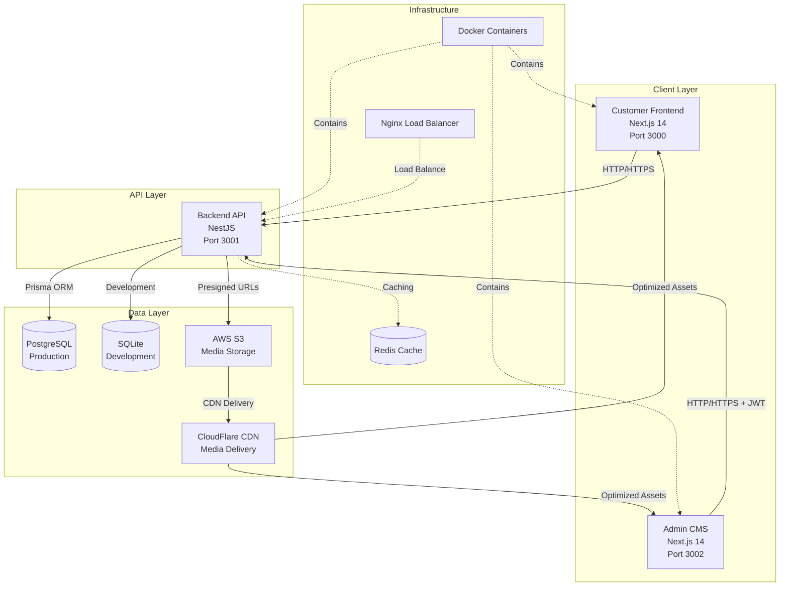

# Design Document - Digital Showroom Complete System

## Overview

The Digital Showroom Complete System is a modern, scalable e-commerce platform for luxury building materials. The system follows a microservices-inspired architecture with clear separation of concerns across four main components: Backend API (NestJS), Customer Frontend (Next.js), Admin CMS (Next.js), and Production Infrastructure (Docker/Cloud).

The architecture prioritizes performance, security, and maintainability through modern technologies including TypeScript, Prisma ORM, JWT authentication, AWS S3 integration, and CDN optimization.

## Architecture

### System Architecture Diagram



### Technology Stack

**Backend API (NestJS)**

- Framework: NestJS 11 with TypeScript
- Database: Prisma ORM with PostgreSQL (production) / SQLite (development)
- Authentication: JWT with Passport.js
- File Upload: AWS S3 with presigned URLs
- Validation: class-validator and class-transformer
- Testing: Jest with property-based testing (fast-check)

**Customer Frontend (Next.js)**

- Framework: Next.js 14 with App Router
- Styling: Tailwind CSS with Framer Motion
- State Management: React Context API
- HTTP Client: Axios with interceptors
- Performance: Image optimization, lazy loading, CDN integration

**Admin CMS (Next.js)**

- Framework: Next.js 14 with App Router
- UI Components: Radix UI with Tailwind CSS
- Authentication: JWT-based protected routes
- File Upload: Drag-and-drop with progress indicators
- Testing: Jest + React Testing Library

**Infrastructure**

- Containerization: Docker with multi-stage builds
- Database: PostgreSQL 15 with connection pooling
- Caching: Redis for session and query caching
- CDN: CloudFlare for media delivery
- Monitoring: Health checks and logging

## Components and Interfaces

### Backend API Components

#### Authentication Module

```typescript
interface AuthService {
  login(credentials: LoginDto): Promise<AuthResponse>;
  validateToken(token: string): Promise<User>;
  refreshToken(refreshToken: string): Promise<AuthResponse>;
}

interface AuthResponse {
  accessToken: string;
  refreshToken: string;
  user: UserProfile;
  expiresIn: number;
}
```

#### Product Management Module

```typescript
interface ProductService {
  create(productData: CreateProductDto): Promise<Product>;
  findAll(filters: ProductFilters): Promise<PaginatedProducts>;
  findById(id: string): Promise<Product>;
  update(id: string, updateData: UpdateProductDto): Promise<Product>;
  delete(id: string): Promise<void>;
  search(query: SearchQuery): Promise<SearchResults>;
}

interface Product {
  id: string;
  name: string;
  description: string;
  sku: string;
  technicalSpecs: JsonValue; // JSONB field
  categoryId: string;
  styleTags: StyleTag[];
  spaceTags: SpaceTag[];
  media: Media[];
  isPublished: boolean;
  createdAt: Date;
  updatedAt: Date;
}
```

#### Media Management Module

```typescript
interface MediaService {
  generatePresignedUrl(
    fileInfo: FileUploadRequest,
  ): Promise<PresignedUrlResponse>;
  createMediaRecord(mediaData: CreateMediaDto): Promise<Media>;
  updateMediaOrder(
    productId: string,
    mediaOrder: MediaOrderDto[],
  ): Promise<void>;
  setCoverImage(productId: string, mediaId: string): Promise<void>;
  deleteMedia(mediaId: string): Promise<void>;
}

interface Media {
  id: string;
  productId: string;
  type: MediaType; // 'lifestyle' | 'cutout' | 'video' | '3d' | 'pdf'
  filename: string;
  s3Key: string;
  cdnUrl: string;
  size: number;
  order: number;
  isCover: boolean;
  createdAt: Date;
}
```

#### Lead Management Module

```typescript
interface LeadService {
  create(leadData: CreateLeadDto): Promise<Lead>;
  findAll(filters: LeadFilters): Promise<PaginatedLeads>;
  findById(id: string): Promise<Lead>;
  updateStatus(id: string, status: LeadStatus): Promise<Lead>;
  getAnalytics(dateRange: DateRange): Promise<LeadAnalytics>;
}

interface Lead {
  id: string;
  type: "appointment" | "quote";
  customerName: string;
  email: string;
  phone?: string;
  projectDetails: string;
  preferredDate?: Date;
  status: "new" | "contacted" | "converted";
  createdAt: Date;
  updatedAt: Date;
}
```

### Frontend Components Architecture

#### Customer Frontend Structure

```typescript
// App Router Structure
app/
├── layout.tsx                 // Root layout with providers
├── page.tsx                   // Home page with featured products
├── products/
│   ├── page.tsx              // Product listing with filters
│   └── [id]/page.tsx         // Product detail page
├── search/
│   └── page.tsx              // Search results page
└── contact/
    └── page.tsx              // Lead capture forms

// Component Architecture
components/
├── ui/                       // Reusable UI components
├── product/                  // Product-specific components
│   ├── ProductGrid.tsx
│   ├── ProductCard.tsx
│   ├── ProductFilters.tsx
│   └── ProductGallery.tsx
├── forms/                    // Form components
│   ├── LeadCaptureForm.tsx
│   └── SearchForm.tsx
└── layout/                   // Layout components
    ├── Header.tsx
    ├── Footer.tsx
    └── Navigation.tsx
```

#### Admin CMS Structure

```typescript
// Protected Dashboard Structure
app/
├── login/page.tsx            // Authentication page
└── dashboard/
    ├── layout.tsx            // Dashboard layout with sidebar
    ├── page.tsx              // Dashboard overview
    ├── products/             // Product management
    ├── categories/           // Category management
    ├── tags/                 // Tag management
    ├── media/                // Media management
    └── leads/                // Lead management

// Service Layer
lib/
├── api-client.ts             // Axios client with JWT interceptors
├── auth-service.ts           // Authentication utilities
├── product-service.ts        // Product API calls
├── media-service.ts          // Media upload and management
└── lead-service.ts           // Lead management API calls
```

## Data Models

### Database Schema (Prisma)

```prisma
model User {
  id        String   @id @default(cuid())
  email     String   @unique
  password  String
  name      String
  role      Role     @default(ADMIN)
  createdAt DateTime @default(now())
  updatedAt DateTime @updatedAt
}

model Category {
  id          String     @id @default(cuid())
  name        String
  description String?
  parentId    String?
  parent      Category?  @relation("CategoryHierarchy", fields: [parentId], references: [id])
  children    Category[] @relation("CategoryHierarchy")
  products    Product[]
  createdAt   DateTime   @default(now())
  updatedAt   DateTime   @updatedAt
}

model StyleTag {
  id          String    @id @default(cuid())
  name        String    @unique
  description String?
  products    Product[] @relation("ProductStyleTags")
  createdAt   DateTime  @default(now())
  updatedAt   DateTime  @updatedAt
}

model SpaceTag {
  id          String    @id @default(cuid())
  name        String    @unique
  description String?
  products    Product[] @relation("ProductSpaceTags")
  createdAt   DateTime  @default(now())
  updatedAt   DateTime  @updatedAt
}

model Product {
  id              String     @id @default(cuid())
  name            String
  description     String
  sku             String     @unique
  technicalSpecs  Json       // JSONB for flexible specifications
  categoryId      String
  category        Category   @relation(fields: [categoryId], references: [id])
  styleTags       StyleTag[] @relation("ProductStyleTags")
  spaceTags       SpaceTag[] @relation("ProductSpaceTags")
  media           Media[]
  isPublished     Boolean    @default(false)
  createdAt       DateTime   @default(now())
  updatedAt       DateTime   @updatedAt

  @@index([name, sku, description])
  @@index([categoryId])
  @@index([isPublished])
}

model Media {
  id        String    @id @default(cuid())
  productId String
  product   Product   @relation(fields: [productId], references: [id], onDelete: Cascade)
  type      MediaType
  filename  String
  s3Key     String    @unique
  cdnUrl    String
  size      Int
  order     Int       @default(0)
  isCover   Boolean   @default(false)
  createdAt DateTime  @default(now())
  updatedAt DateTime  @updatedAt

  @@index([productId, order])
  @@index([productId, isCover])
}

model Lead {
  id             String     @id @default(cuid())
  type           LeadType
  customerName   String
  email          String
  phone          String?
  projectDetails String
  preferredDate  DateTime?
  status         LeadStatus @default(NEW)
  createdAt      DateTime   @default(now())
  updatedAt      DateTime   @updatedAt

  @@index([status])
  @@index([createdAt])
  @@index([email])
}

enum Role {
  ADMIN
  MANAGER
}

enum MediaType {
  LIFESTYLE
  CUTOUT
  VIDEO
  THREE_D
  PDF
}

enum LeadType {
  APPOINTMENT
  QUOTE
}

enum LeadStatus {
  NEW
  CONTACTED
  CONVERTED
}
```

### API Response Formats

```typescript
// Standardized API Response
interface ApiResponse<T> {
  success: boolean;
  data?: T;
  error?: {
    code: string;
    message: string;
    details?: any;
  };
  meta?: {
    pagination?: PaginationMeta;
    timestamp: string;
  };
}

// Pagination
interface PaginationMeta {
  page: number;
  limit: number;
  total: number;
  totalPages: number;
  hasNext: boolean;
  hasPrev: boolean;
}

// Search Results
interface SearchResults {
  products: Product[];
  facets: {
    categories: CategoryFacet[];
    styleTags: TagFacet[];
    spaceTags: TagFacet[];
    priceRanges: PriceRangeFacet[];
  };
  meta: PaginationMeta;
}
```

## Correctness Properties

_A property is a characteristic or behavior that should hold true across all valid executions of a system—essentially, a formal statement about what the system should do. Properties serve as the bridge between human-readable specifications and machine-verifiable correctness guarantees._

<function_calls>
<invoke name="prework">
<parameter name="featureName">digital-showroom-complete

### Property Reflection

After analyzing all acceptance criteria, I identified several areas where properties can be consolidated to eliminate redundancy:

**Authentication Properties**: Multiple criteria about JWT validation, token refresh, and protected routes can be combined into comprehensive authentication properties.

**CRUD Operations**: Similar CRUD patterns across products, categories, tags, and leads can be consolidated into generic CRUD properties.

**Data Validation**: Multiple validation criteria can be combined into comprehensive validation properties.

**API Communication**: Frontend-backend communication properties can be consolidated.

**File Upload**: Media upload and S3 integration properties can be combined.

### Correctness Properties

Based on the prework analysis, the following properties validate the system's correctness:

**Property 1: RESTful API Completeness**
_For any_ system entity type (Product, Category, StyleTag, SpaceTag, Lead), the Backend API should provide complete CRUD endpoints that respond with appropriate HTTP status codes and data formats.
**Validates: Requirements 1.1, 7.2**

**Property 2: JWT Authentication Consistency**
_For any_ protected API endpoint, when provided with a valid JWT token, the request should succeed, and when provided with an invalid or expired token, the request should fail with a 401 status code.
**Validates: Requirements 1.2, 5.1, 5.4, 7.1**

**Property 3: Input Validation Universality**
_For any_ API endpoint accepting input data, when provided with invalid data according to the defined validation rules, the API should reject the request with appropriate error messages and status codes.
**Validates: Requirements 1.4, 5.7, 7.5**

**Property 4: Product Data Integrity**
_For any_ product creation or update operation, all required fields (name, description, SKU, technical specifications) should be stored correctly and retrievable through the API.
**Validates: Requirements 2.1, 2.4**

**Property 5: Hierarchical Category Consistency**
_For any_ category with parent-child relationships, the hierarchy should be maintained correctly with proper referential integrity and no circular references.
**Validates: Requirements 2.2**

**Property 6: Many-to-Many Relationship Integrity**
_For any_ product with associated style tags and space tags, the relationships should be maintained correctly through create, update, and delete operations.
**Validates: Requirements 2.3**

**Property 7: Search Result Accuracy**
_For any_ search query containing terms, all returned products should contain the search terms in their name, SKU, or description fields.
**Validates: Requirements 2.5, 6.3**

**Property 8: Filter Result Consistency**
_For any_ applied filter (category, tags, technical specifications), all returned products should match the filter criteria exactly.
**Validates: Requirements 2.6, 6.2**

**Property 9: Product Publishing Workflow**
_For any_ product, toggling the published status should affect its visibility in customer-facing endpoints while maintaining accessibility in admin endpoints.
**Validates: Requirements 2.7**

**Property 10: Audit Trail Completeness**
_For any_ product modification operation, an audit record should be created containing the change details, timestamp, and user information.
**Validates: Requirements 2.8**

**Property 11: Media Type Support**
_For any_ supported media type (lifestyle, cutout, video, 3D, PDF), the system should accept uploads and store metadata correctly.
**Validates: Requirements 3.1**

**Property 12: File Validation Enforcement**
_For any_ file upload attempt, files exceeding size limits or having unsupported types should be rejected with appropriate error messages.
**Validates: Requirements 3.2**

**Property 13: Media Ordering Consistency**
_For any_ product with multiple media items, reordering operations should maintain the specified order consistently across all API responses.
**Validates: Requirements 3.3**

**Property 14: Cover Image Uniqueness**
_For any_ product, only one media item can be designated as the cover image, and setting a new cover image should remove the previous designation.
**Validates: Requirements 3.4**

**Property 15: Presigned URL Functionality**
_For any_ valid file upload request, the generated presigned URL should allow successful upload to S3 within the expiration time.
**Validates: Requirements 3.5**

**Property 16: Media Metadata Completeness**
_For any_ uploaded media file, all metadata (filename, size, type, S3 key) should be stored accurately and retrievable.
**Validates: Requirements 3.6**

**Property 17: Cascade Deletion Integrity**
_For any_ product deletion, all associated media records should be automatically deleted while maintaining referential integrity.
**Validates: Requirements 3.7**

**Property 18: CDN URL Generation**
_For any_ media item, the provided CDN URL should be accessible and serve the correct file content.
**Validates: Requirements 3.8**

**Property 19: Lead Data Capture Completeness**
_For any_ lead creation request, all provided contact details and inquiry information should be stored accurately and retrievable.
**Validates: Requirements 4.1, 4.3**

**Property 20: Lead Type Support**
_For any_ lead creation, both appointment and quote request types should be supported with appropriate validation and processing.
**Validates: Requirements 4.2**

**Property 21: Lead Status Workflow**
_For any_ lead, status transitions should follow the defined workflow (New → Contacted → Converted) and maintain history.
**Validates: Requirements 4.4, 4.8**

**Property 22: Lead Filtering Accuracy**
_For any_ lead filter criteria (status, date range), all returned leads should match the specified criteria exactly.
**Validates: Requirements 4.5**

**Property 23: Lead Analytics Calculation**
_For any_ lead, calculated analytics (days since creation, status duration) should be mathematically correct based on timestamps.
**Validates: Requirements 4.6**

**Property 24: Email Notification Delivery**
_For any_ new lead creation, an email notification should be sent to the configured recipients within a reasonable time frame.
**Validates: Requirements 4.7**

**Property 25: Password Security**
_For any_ user password, it should be hashed using bcrypt and never stored or transmitted in plain text.
**Validates: Requirements 5.2**

**Property 26: Token Generation and Validation**
_For any_ successful login, a valid JWT token should be generated, and subsequent requests with this token should be authenticated until expiration.
**Validates: Requirements 5.3, 5.5**

**Property 27: Role-Based Access Control**
_For any_ user with a specific role, access to endpoints should be granted or denied based on the role's permissions.
**Validates: Requirements 5.6**

**Property 28: Rate Limiting Enforcement**
_For any_ authentication endpoint, excessive requests from the same source should be rate-limited with appropriate error responses.
**Validates: Requirements 5.8**

**Property 29: Frontend Responsive Layout**
_For any_ screen size within the supported range, the customer frontend should display products in an appropriate grid layout without horizontal scrolling.
**Validates: Requirements 6.1**

**Property 30: Media Gallery Lazy Loading**
_For any_ product detail page, media items should load progressively as they come into view, improving initial page load performance.
**Validates: Requirements 6.4**

**Property 31: Lead Form Submission**
_For any_ valid lead form submission (appointment or quote request), a lead record should be created in the system and confirmation provided to the user.
**Validates: Requirements 6.5**

**Property 32: Pagination Functionality**
_For any_ product listing with pagination, navigating through pages should maintain filter and search criteria while loading the correct subset of results.
**Validates: Requirements 6.6**

**Property 33: Product Detail Completeness**
_For any_ product detail page, all available technical specifications and media should be displayed in an organized, accessible format.
**Validates: Requirements 6.7**

**Property 34: CMS CRUD Operations**
_For any_ entity type in the CMS (products, categories, tags), create, read, update, and delete operations should work correctly with proper validation and error handling.
**Validates: Requirements 7.2**

**Property 35: File Upload Progress Indication**
_For any_ file upload operation in the CMS, progress should be indicated to the user and completion/error status should be clearly communicated.
**Validates: Requirements 7.3**

**Property 36: CMS Search and Pagination**
_For any_ entity listing in the CMS, search functionality should filter results accurately and pagination should work correctly.
**Validates: Requirements 7.6**

**Property 37: Bulk Operations Consistency**
_For any_ bulk operation (delete, update status), all selected items should be processed consistently with appropriate success/error reporting.
**Validates: Requirements 7.7**

**Property 38: Analytics Accuracy**
_For any_ displayed analytics in the CMS, calculations should be mathematically correct based on the underlying data.
**Validates: Requirements 7.8**

**Property 39: API Communication Protocol**
_For any_ API request from frontend applications, the correct endpoint URLs, HTTP methods, and authentication headers should be used.
**Validates: Requirements 8.1, 8.2**

**Property 40: Error Message User-Friendliness**
_For any_ API error response, frontend applications should display user-friendly error messages rather than technical error details.
**Validates: Requirements 8.3**

**Property 41: Network Resilience**
_For any_ network failure during API communication, the system should implement retry mechanisms and graceful degradation.
**Validates: Requirements 8.4**

**Property 42: Validation Consistency**
_For any_ data validation rule, the same validation should be applied consistently across frontend and backend components.
**Validates: Requirements 8.5**

**Property 43: Caching Behavior**
_For any_ cacheable static content, repeated requests should be served from cache when appropriate, reducing server load.
**Validates: Requirements 9.5**

**Property 44: Database Migration Integrity**
_For any_ database migration operation, the schema should be updated correctly and rollback should restore the previous state exactly.
**Validates: Requirements 10.2**

**Property 45: Backup Data Integrity**
_For any_ automated backup operation, the backed-up data should be complete and restorable to a functional state.
**Validates: Requirements 10.6**

**Property 46: Logging Completeness**
_For any_ significant system operation, appropriate log entries should be generated with sufficient detail for monitoring and debugging.
**Validates: Requirements 10.7**

**Property 47: Database Transaction Atomicity**
_For any_ multi-table operation, either all changes should be committed successfully or all changes should be rolled back on failure.
**Validates: Requirements 11.1**

**Property 48: Foreign Key Validation**
_For any_ deletion attempt on a record with foreign key references, the operation should be prevented with an appropriate error message.
**Validates: Requirements 11.2**

**Property 49: Cascade Deletion Policy**
_For any_ parent record deletion, all dependent child records should be deleted automatically according to the defined cascade policies.
**Validates: Requirements 11.3**

**Property 50: Referential Integrity Maintenance**
_For any_ database operation, referential integrity constraints should be maintained, preventing orphaned records.
**Validates: Requirements 11.4**

**Property 51: Optimistic Locking Behavior**
_For any_ concurrent update attempt on the same record, optimistic locking should prevent data corruption and provide appropriate conflict resolution.
**Validates: Requirements 11.5**

**Property 52: JSONB Schema Validation**
_For any_ technical specification update, the JSONB structure should be validated against the defined schema before storage.
**Validates: Requirements 11.6**

**Property 53: Data Migration Consistency**
_For any_ data migration script execution, the data should be transformed correctly without loss or corruption.
**Validates: Requirements 11.7**

**Property 54: Data Export/Import Round-Trip**
_For any_ data export followed by import operation, the imported data should be identical to the original exported data.
**Validates: Requirements 11.8**

## Error Handling

### Error Response Format

All API endpoints follow a standardized error response format:

```typescript
interface ErrorResponse {
  success: false;
  error: {
    code: string; // Machine-readable error code
    message: string; // Human-readable error message
    details?: any; // Additional error context
    field?: string; // Field name for validation errors
  };
  meta: {
    timestamp: string; // ISO 8601 timestamp
    requestId: string; // Unique request identifier for tracing
  };
}
```

### Error Categories

**Validation Errors (400)**

- Invalid input data format
- Missing required fields
- Field value constraints violated
- JSONB schema validation failures

**Authentication Errors (401)**

- Missing or invalid JWT token
- Token expiration
- Invalid credentials
- Rate limiting exceeded

**Authorization Errors (403)**

- Insufficient permissions for operation
- Role-based access control violations
- Resource ownership restrictions

**Resource Errors (404)**

- Entity not found
- Endpoint not available
- Media file not accessible

**Conflict Errors (409)**

- Duplicate SKU or unique constraint violations
- Optimistic locking conflicts
- Foreign key constraint violations

**Server Errors (500)**

- Database connection failures
- S3 service unavailable
- Unexpected application errors
- External service timeouts

### Frontend Error Handling

**Customer Frontend**

- Display user-friendly error messages for all error types
- Implement retry mechanisms for network failures
- Provide fallback content for missing media
- Show loading states during API operations

**Admin CMS**

- Display detailed validation errors on forms
- Implement bulk operation error reporting
- Provide error recovery suggestions
- Maintain operation history for debugging

## Testing Strategy

### Dual Testing Approach

The system implements both unit testing and property-based testing for comprehensive coverage:

**Unit Tests**

- Verify specific examples and edge cases
- Test integration points between components
- Validate error conditions and boundary values
- Focus on concrete scenarios and known use cases

**Property-Based Tests**

- Verify universal properties across all inputs
- Use randomized input generation for comprehensive coverage
- Validate system invariants and business rules
- Test with minimum 100 iterations per property

### Property-Based Testing Configuration

**Backend API (NestJS + Jest + fast-check)**

```typescript
// Example property test configuration
describe("Product Management Properties", () => {
  it("Property 4: Product Data Integrity", async () => {
    await fc.assert(
      fc.asyncProperty(
        fc.record({
          name: fc.string({ minLength: 1, maxLength: 100 }),
          description: fc.string({ minLength: 1, maxLength: 1000 }),
          sku: fc.string({ minLength: 1, maxLength: 50 }),
          technicalSpecs: fc.object(),
        }),
        async (productData) => {
          const created = await productService.create(productData);
          const retrieved = await productService.findById(created.id);

          expect(retrieved.name).toBe(productData.name);
          expect(retrieved.description).toBe(productData.description);
          expect(retrieved.sku).toBe(productData.sku);
          expect(retrieved.technicalSpecs).toEqual(productData.technicalSpecs);
        },
      ),
      { numRuns: 100 },
    );
  });
});
```

**Frontend Applications (Jest + React Testing Library)**

```typescript
// Example component property test
describe('Product Grid Properties', () => {
  it('Property 29: Frontend Responsive Layout', () => {
    fc.assert(
      fc.property(
        fc.array(fc.record({ id: fc.string(), name: fc.string() })),
        fc.integer({ min: 320, max: 1920 }),
        (products, screenWidth) => {
          render(<ProductGrid products={products} />);
          // Verify responsive behavior at different screen widths
          expect(screen.getByTestId('product-grid')).toBeInTheDocument();
          // Additional responsive layout assertions
        }
      ),
      { numRuns: 100 }
    );
  });
});
```

### Test Data Management

**Development Environment**

- Prisma seed scripts for consistent test data
- Factory functions for generating test entities
- Database reset capabilities between test runs

**Property Test Generators**

- Smart generators that respect business constraints
- Realistic data generation for better test coverage
- Edge case generation for boundary testing

### Integration Testing

**API Integration Tests**

- End-to-end workflow testing
- Authentication flow validation
- File upload and media management
- Lead capture and processing

**Frontend Integration Tests**

- User journey testing
- Form submission workflows
- Search and filtering functionality
- Responsive design validation

### Performance Testing

**Load Testing**

- API endpoint performance under load
- Database query optimization validation
- CDN delivery performance
- Concurrent user simulation

**Property Test Performance**

- Each property test runs with 100+ iterations
- Performance regression detection
- Memory usage validation
- Resource cleanup verification

### Test Execution Strategy

**Continuous Integration**

- Automated test execution on code changes
- Property-based test integration in CI pipeline
- Test result reporting and failure analysis
- Coverage reporting and quality gates

**Test Environment Management**

- Isolated test databases for each test run
- Mock external services (S3, email) for unit tests
- Integration test environment with real services
- Production-like staging environment for final validation
